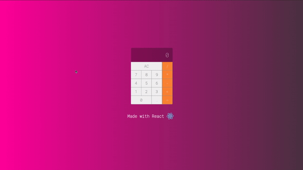

# React Calculator

Calculator made with react.

<p align="center">

</p>


## About
It's a calculator developed in React designed to make four simple basic operations.

This is a project created to apply my studies on react framework.


## Features

- [x] Basic Operations
- [ ] Error Display Animation


## 🚀 Getting Started

These instructions will allow you to obtain a copy of the project on your local machine for development and testing purposes.


### 📋 Prerequisites

You need to have Node 14+ and React installed on your machine.


### 🔧 Install and Run

Clone the project
```sh
git clone
```

Start project

```sh
cd react-calculator
npm start
```
The application should be up and running at [http://localhost:3000](http://localhost:3000)


## 🛠️ Technologies

* [React](https://reactjs.org/)


## Autor

<a href="https://github.com/Ruy-Araujo">
 
 <br />
 <sub><b>Ruy Araujo</b></sub></a> 

## 📄 License

This project is under MIT-license - see file [LICENSE.md](https://github.com/usuario/projeto/licenca) for details.


